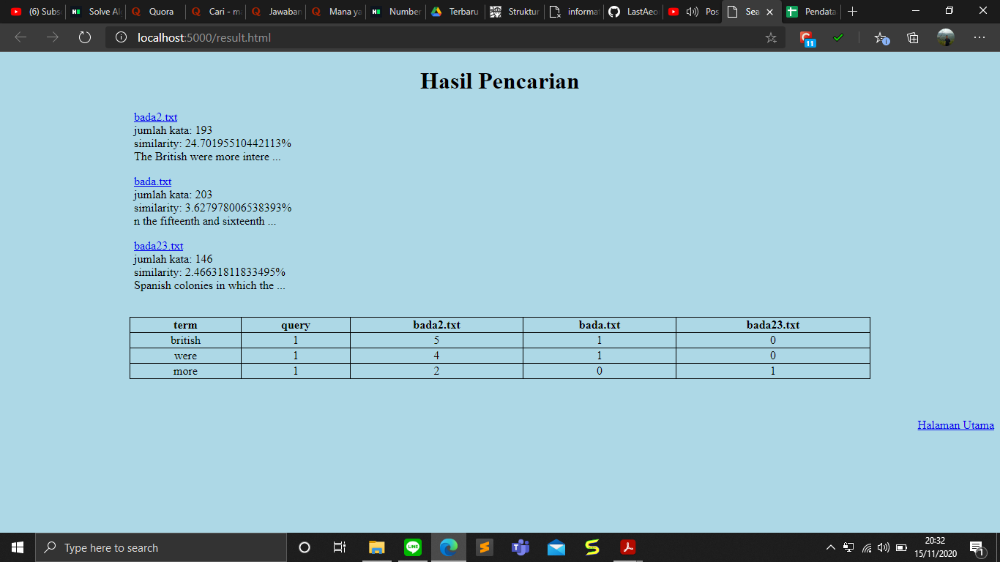

# Algeo02-19149
> Simple search engine with Cosine Simmilarity principle.

## Table of contents
* [General info](#general-info)
* [Screenshots](#screenshots)
* [Technologies](#technologies)
* [Setup](#setup)
* [Features](#features)
* [Status](#status)
* [Inspiration](#inspiration)
* [Credits](#credits)

## General info
Dibuat untuk memenuhi tugas besar mata kuliah IF2123 Aljabar Linear dan Geometri

## Screenshots

## Technologies
* Flask, Python, dan HTML

## Setup
Keterangan: Instalasi dilakukan di Windows, Python sudah ada, dan Git sudah ada.
1. Buka terminal di direktori favorit Anda.
2. Jalankan perintah "git clone https://github.com/LastAeon/Algeo02-19149".
3. Jalankan perintah "cd Algeo2-19149/src".
4. Jalankan perintah "py -m venv env". Lalu, sebuah folder bernama "venv" seharusnya telah dibuat di folder src. Folder tersebut adalah _Virtual Environment_ untuk menjalankan website.
5. Jalankan perintah "env\Scripts\activate".
6. Jalankan perintah "set FLASK_APP=app.py".
7. Install flask dengan menjalankan perintah ini "pip install flask".
8. Jalankan perintah "flask run".
9. Website di _localhost_ sudah bisa diakses dan search engine bisa digunakan di 127.0.0.1:5000 atau localhost:5000.

## Features
* Search Engine
* Penjelasan cara pakai
* Laman tentang kami

## Status
_Finished_

## Inspiration
based on IF2123 Aljabar Linear Geometri, Bandung Institute Technology

## Credits
Created by Syihabuddin Yahya Muhammad - 13519149, Nabil Nabighah - 13519168, Allief Nuriman - 13519221
